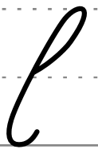

# Schnellschrift

* [Wörterbuch](wörterbuch.md)

Alle Einträge im Wörterbuch werden kleingeschrieben.

## Vokale `.`

 ab `.ab`

 echt `.echt`

 hammer `h.am.er`

 kopf `k.opf`

 leid `l.eid`

 mir `m.ir`

 reif `r.eif`

 um `.um`

 vier `v.ir`

## `CH`, `H`, `N`, `T`, ...

 ein `N`

 feinheit `f.N.H`

 heiter `h.T.er`

 wein `w.N`

## Kürzel

 *noch* `nch`

 sich `CH`

 *vielleicht* `v.ei`

 *sonder* `S`

## Schlaufe

*besonders* `b°`

*d. h.* `d.h°`

## Ausfall von -e-

 *vater* `v.at-er` = `v.atr`

## Ausfall von -l-, -n-, -r- im Auslaut

 ort `.ot`

 spontan `sp.ot.an`

Der Aufstrich des -t- bleiben, wenn der Anlaut den Inlaut andeuten kann.

 bunt `but`

 start `stat`

 wort `wot`

Die Linkswendigkeit des -s- bleibt erhalten.

 hals `h.a-s` = `h.aS`

## Anlautkürzung

-haft
zusammen
da-

 **bald** `ba`

 **bis** `bi`

 **her** `h`

 **statt** `sta`

 **wo** `wo`

## Auslautkürzung

 ***mut*** `.ut`

## Anlautkürzel

 **f**ür `f`

 **i**st `i`

## Auslautkürzel

 *ber****lin*** `(l.in)`

 *sp****ort*** `(.ot)`

## Anstellen

 **bis**<i></i>**her** `(bi)h`

-----

## Fragen

Ist "ist" ein Anlautkürzel?

 **i**st/***i****st* `i`

<!--
Fenster mit .er
-->
